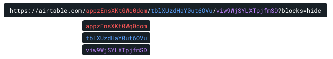

# Overview

Set up a two-way sync for your Airtable table in Dataland.

If the `ALLOW_WRITEBACK_FLAG` is enabled, any changes done in the Dataland UI will execute a transaction that writes back to your Airtable.

This includes:

- Creating new records
- Updating existing record fields, except for computed columns\*. See details below.
- Deleting records

Dataland always treats your Airtable instance as the source of truth. Any invalid transactions attempted from Dataland will be rejected by your source Airtable, and then overriden in Dataland by the next sync from Airtable. For example, since the Airtable API prevents updates to formula column values, any change from Dataland to a formula column will be rejected.

Data in the Dataland UI will be re-updated every 15 minutes by default. This cadence can be configurable.

## Parameter setup

| Name                      | About                                                                                                                                       |
| ------------------------- | ------------------------------------------------------------------------------------------------------------------------------------------- |
| `airtable-api-key`        | Your API key. This can take a service user's API key to lock down specific permissions on the Airtable side.                                |
| `airtable-base-id`        | A base's ID                                                                                                                                 |
| `airtable-table-name`     | A table's ID or display name                                                                                                                |
| `airtable-view-name`      | A view's ID or display name                                                                                                                 |
| `allow-writeback-boolean` | If `true`, row updates/creation/deletion in Dataland will attempt writebacks to your Airtable table. If `false`, no writeback is attempted. |
| `dataland-table-name`     | Dataland will create a table with this name, and replicate Airtable data into it                                                            |

### How to get the Airtable IDs for base, table, and view

Go to your Airtable table in the browser. If using the Airtabledesktop app, press `Ctrl` + `L` on Windows or `⌘` + `L` on Mac to get the link.

You can then parse out the base ID, table ID, and view ID like shown:

`https://airtable.com/{{base-id}}/{{table-id}}/{{view-id}}?blocks=hide`

For example:

## Computed columns that reject external updates

Airtable has certain fields that reject any updates via API, and will therefore reject updates from Dataland:

- Autonumber
- Button
- Count
- Created time, Created By, Modified time, Modified by
- Formula
- Lookup
- Rollup
