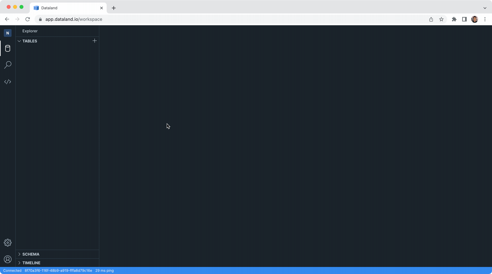
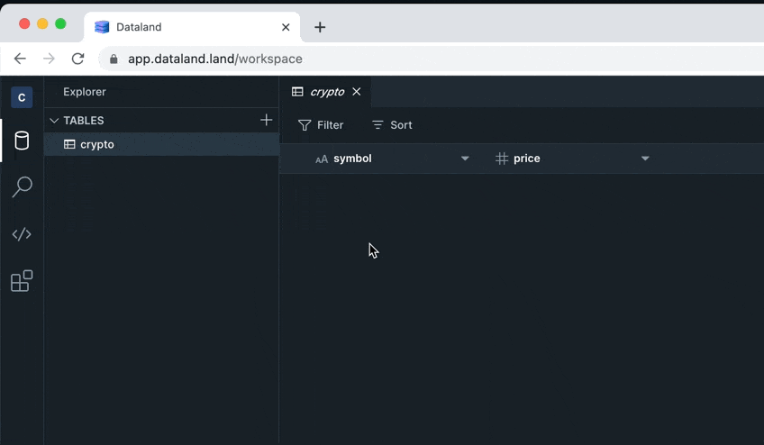

# Crypto Lookup Example

## Setup

1. Install the Dataland CLI:

   ```sh
   brew install dataland-io/tap/dataland-cli
   ```

2. Sign up at [app.dataland.io](https://app.dataland.io/) and follow the prompts to create a new workspace.

3. Create a Secret Access Key for your account:

   

4. Configure the Dataland CLI with your Secret Access Key:

   ```sh
   dataland config init
   ```

5. Grab the code for this crypto-lookup example:

   ```sh
   git clone https://github.com/dataland-io/dataland-examples
   cd dataland-examples/crypto-lookup
   npm install
   ```

6. Sign up for a free CoinMarketCap API key here: https://pro.coinmarketcap.com/

7. Create a `.env` file in the root of the `crypto-lookup` folder, and add this line with your API key value:

   ```
   DL_PARAM_COINMARKETCAP_API_KEY='{YOUR_KEY}'
   ```

8. Deploy the quickstart example to your Dataland workspace:

   ```sh
   # inside dataland-examples/crypto-lookup
   dataland deploy
   ```

9. Verify that the example was successfully deployed.

   Go to the Dataland UI, open the newly created `crypto` table, and add a row with an example coin ticker like `ETH`. You should see a price respond back in the second column:

   
