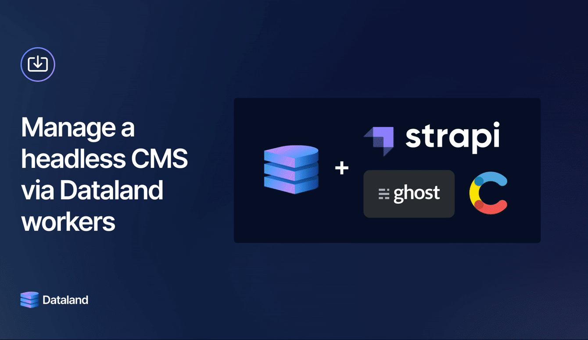

# Pushing content to Strapi

Dataland can be a better admin panel for a headless CMS, like Strapi (used in this example), Ghost, or Contentful. Dataland gives you an intuitive table-like UI to edit data, and smart content enrichment via Dataland workers.

This directory consists of:

- A table that maps onto a Strapi CMS collection
- A worker that upserts a row's data in Dataland into the Strapi CMS. It gets triggered when a user clicks an in-line table button.

Here's how it looks in practice:



For this example:

- An example store front-end that lists a Strapi item collection: https://strapi-cms-app.vercel.app/
- The Strapi CMS is hosted here: https://strapi-cms-example.herokuapp.com/admin.

<details>
<summary>You can login into the Strapi CMS admin panel with these credentials: (click to show)</summary>

- Username: `demo@demo.com`
- Password: `Demo123!`

</details>

Running through the below setup will allow your Dataland DB to post / update entries in the Strapi CMS. Note that the Dataland core team will clear out Strapi entries periodically.

## Setup instructions

1. To run this example, clone this repo . Then, from the `strapi-push/` folder, run:

```sh
npm install
dataland deploy
```

2. Authenticate to your workspace with `dataland config init` and your access key. You can get an access key by navigating to Settings > Access keys in the Dataland app.
3. Run `dataland deploy`, then `dataland tail` to start streaming logs.
4. Go to the Dataland app, add a row to the `Strapi Items` table, and click the `Push to CMS` button to make an API POST request with that row's data into the Strapi CMS.
5. You'll see the item appear on https://strapi-cms-app.vercel.app/.

If you'd like to configure your own private example:

1. Construct your own private Strapi CMS for testing, follow the quickstart on Strapi's docs: https://docs.strapi.io/developer-docs/
2. Update the `strapiPush.ts` file and `spec.yaml` fil accordingly to your own collection schema.
